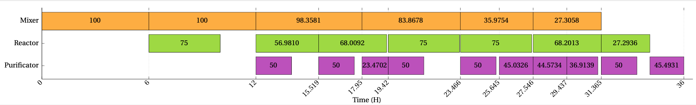
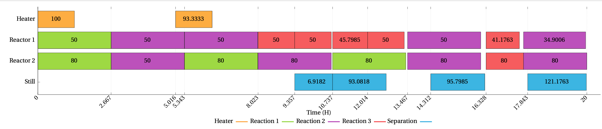

# Chemical Batch Processing Simulator and Optimisation Experiments for Scheduling

Applying selected metaheuristics to the optimisation of the scheduling with respect to profit (amount of chemical(s) produced in a fixed length of time) and makespan (minimising process time for fixed amount of profit). The schedules' mathematical representations and formulation come from the first paper listed below.

MBP = Metaheuristics for Batch Processing

## Related Papers

"On the application of a metaheuristic suite with parallel implementations for the scheduling of multipurpose batch plants" (M. Woolway, T. Majozi, 2019)

URL: https://www.sciencedirect.com/science/article/abs/pii/S0098135419300146

"Comparative Metaheuristic Performance for the Scheduling of Multipurpose Batch Plants" (Z. D. Bowditch, M. Woolway, T.L van Zyl)

URL: https://ieeexplore.ieee.org/document/9004315
